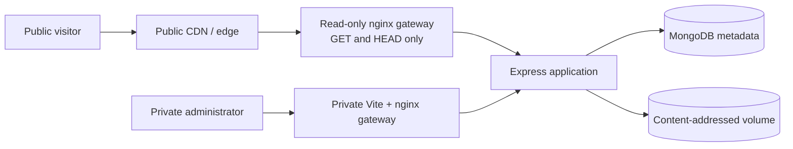

<div align="center">


# Self-Hosted CDN

**Private administration. Content-addressed storage. Read-only public delivery.**

[](https://nodejs.org/)
[](https://docs.docker.com/compose/)
[](https://www.mongodb.com/)
[](LICENSE)

</div>

## About the project

Self-Hosted CDN is a compact file-delivery platform for personal sites, portfolio projects, and small private infrastructure. It separates a private upload and management dashboard from a deliberately narrow public gateway, then stores objects under immutable SHA-256 names for predictable caching and duplicate detection.

The repository is designed as reusable public source. Live hostnames, credentials, private network details, uploaded files, and deployment overlays belong outside Git.

## Highlights

- Private React administration dashboard with API-key protected upload, listing, and deletion.
- Read-only public nginx gateway restricted to `GET` and `HEAD /cdn/*`.
- Content-addressed filenames, duplicate detection, ETags, and one-year immutable cache headers.
- Disk-backed uploads with size, MIME, extension, quota, and free-space validation.
- Separate Docker networks for MongoDB, application traffic, and gateways.
- Request and connection limits at the public origin.
- Health checks, structured logs, graceful shutdown, tests, and operational documentation.
- Broad format support for images, documents, archives, audio, video, and fonts.

## Architecture



| Boundary | Default bind | Responsibility |
|---|---:|---|
| Express application | `127.0.0.1:3000` | Private API, metadata, validation, and object delivery |
| Public gateway | `127.0.0.1:3001` | Only `GET`/`HEAD` below `/cdn/` |
| Private dashboard | `127.0.0.1:3002` | SPA plus private `/api/*`, `/health/*`, and `/cdn/*` proxying |
| MongoDB | Docker network only | Metadata; never published to the host |

## Quick start

### Requirements

- Docker Engine with Docker Compose
- A long random administration key
- Enough disk space for the configured object quota and backups

### Configure and start

```powershell
Copy-Item .env.example .env
# Fill every value in .env before continuing.
docker compose config
docker compose build
docker compose up -d
docker compose ps
```

Open the private dashboard at `http://127.0.0.1:3002`. The public gateway is available locally at `http://127.0.0.1:3001/cdn/<sha256>.<extension>`.

Do not expose ports `3000` or `3002` to the public Internet. If you add an edge proxy, it must target only the read-only gateway and should authenticate requests to the origin.

## Configuration

Copy `.env.example` to `.env`; never commit the populated file.

| Variable | Purpose |
|---|---|
| `NODE_ENV` | `production`, `development`, or `test` |
| `MONGO_URI` | MongoDB connection string |
| `ADMIN_API_KEY` | Long random key for private operations |
| `STORAGE_PATH` / `TEMP_STORAGE_PATH` | Persistent and temporary object directories |
| `MAX_UPLOAD_SIZE_MB` | Per-file limit |
| `STORAGE_QUOTA_MB` | Metadata-backed storage quota |
| `MIN_FREE_DISK_MB` | Readiness safety floor |
| `ALLOWED_MIME_TYPES` / `ALLOWED_EXTENSIONS` | Explicit upload allowlists |
| `CORS_ORIGIN` | Private dashboard origin |
| `PUBLIC_CDN_BASE_URL` | Optional public asset base used at dashboard build time |
| `NGINX_CLIENT_MAX_BODY_SIZE` | Outer private-gateway upload limit |

See [docs/operations.md](docs/operations.md) for the complete setup, route, backup, restore, and verification runbook.

## Public deployment example

`vercel-proxy/vercel.example.json` demonstrates external-origin caching with a non-deployable example hostname. Copy it only into a private deployment repository and replace the example there. Never commit a live home-server hostname, tunnel endpoint, credential, or uploaded object to this public project.

## Testing

```powershell
npm test --prefix server
npm audit --omit=dev --prefix server
npm test --prefix client
npm run build --prefix client
node --test tests/*.test.mjs
docker compose config --quiet
```

## Security model

- Public requests are read-only and constrained to content-addressed identifiers.
- Upload, list, and delete operations require the server-side administration key.
- Active text formats and archives are downloaded as attachments with `nosniff`.
- Runtime secrets and storage are excluded from Git and Docker build contexts.
- Public origin traffic is rate- and connection-limited, but operators must still monitor home bandwidth and resource use.

Report security issues privately using [SECURITY.md](SECURITY.md). Do not open a public issue containing credentials, private endpoints, personal data, or exploit details.

## Project structure

```text
client/                 React/Vite administration dashboard
server/                 Express API, MongoDB model, and storage logic
gateway/                Read-only public nginx gateway
private-admin-gateway/  Dashboard build and private reverse proxy
vercel-proxy/            Static landing page and safe deployment example
docs/                   Operations and implementation notes
tests/                  Repository and landing-page checks
```

## Roadmap

- Authenticated edge-to-origin requests.
- Atomic quota reservations for concurrent uploads.
- Backup integrity automation and restore drills.
- Metrics for cache misses, bandwidth, latency, and rejected requests.

## Author

Built by [Charles Naig](https://github.com/CharlesNaig) as part of a portfolio of practical self-hosted systems and connected applications.

## License

Released under the [MIT License](LICENSE).
